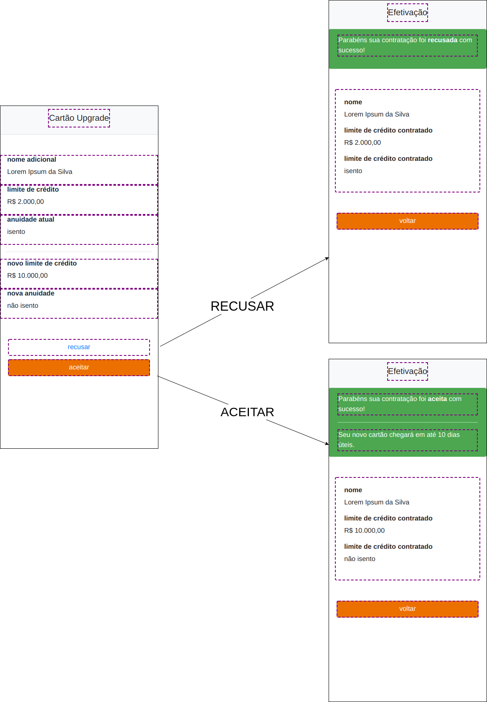

# Formalizacão Remota

This project was generated with [Angular CLI](https://github.com/angular/angular-cli) version 9.1.0.

## Demo
[http://velrino.github.io/formalizacao-remota/](http://velrino.github.io/formalizacao-remota/)

## Development server

Run `ng serve` for a dev server. Navigate to `http://localhost:4200/`. The app will automatically reload if you change any of the source files.

## Spec with accessibility

